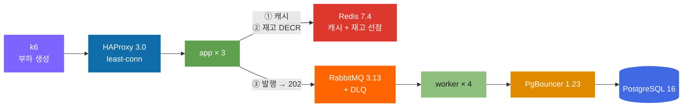

<div align="center">

<picture>
  <source media="(prefers-color-scheme: dark)" srcset="docs/assets/hero-dark.svg">
  
</picture>

<br>


**[실험 기록 9편](docs/labs/)** · **[최종 검증](docs/labs/09-final.md)** · **[SLO·알람](docs/slo.md)** · **[빠른 시작](#-빠른-시작)**

</div>

---

## 한 문장

**티켓 예약 API 하나를 9단계에 걸쳐 일부러 터뜨리고 고치면서, 백엔드의 각 계층이 어디서 왜 무너지는지를 전부 숫자로 남긴 기록입니다.**

목표는 **1,000 RPS · p99 < 200ms · 에러율 < 0.1%** 였고, 9단계 끝에 달성했습니다.

| | 시작 (Phase 01) | 최종 (Phase 09) |
|---|--:|--:|
| 처리량 | 2,000 RPS에서 붕괴 | **1,005 RPS 10분 지속** |
| p99 | — | **105ms** |
| 에러율 | — | **0.05%** |
| 앱 1대 강제 종료 | — | **진짜 실패 2건 / 18.3만** |

> **진짜 산출물은 코드가 아니라 [`docs/labs/`](docs/labs/) 의 측정 기록입니다.**
> 코드는 실험 도구일 뿐입니다.

---

## 9단계에서 배운 것

각 항목은 **실제로 측정한 숫자**입니다. 자세한 근거는 링크된 문서에 있습니다.

> **처리량은 CPU가 정한다.** 요청당 CPU를 10ms 넣으면 100.20 RPS, 30ms면 34.30 RPS. 이론값 `1000/X`와 오차 3% 안에서 일치했습니다. — [Phase 04](docs/labs/04-app-server.md)

> **비동기로 옮겨도 CPU가 없으면 소용없다.** 같은 연산을 스레드풀로 보내니 이벤트 루프 지연은 0이 됐지만 처리량은 34.3 → 24.1 RPS로 **떨어졌습니다.** 일을 다른 데로 보낸 것이지 없앤 게 아니니까요. — [Phase 04](docs/labs/04-app-server.md)

> **빨리 거절하는 게 느려지는 것보다 낫다.** load shedding으로 실패율이 9.6% → 68.7%로 늘었는데, 성공 처리량은 그대로면서 p50이 **21,914ms → 493ms**가 됐습니다. 실패율이 7배 는 게 개선입니다. — [Phase 04](docs/labs/04-app-server.md)

> **"풀이 마른다"는 증상이지 원인이 아니다.** 200만 행 순차 스캔 하나가 커넥션 30개를 전부 묶어 실패율 85.8%를 만들었는데, 풀은 손대지 않고 **인덱스 하나만 추가하니** 처리량 7.9배, 실패율 0%. — [Phase 05](docs/labs/05-db-pool.md)

> **앱 풀과 DB 프록시는 대체 관계가 아니다.** 앱 6대 × 풀 20 = 120을 열려 해도 PgBouncer를 끼우면 DB가 받는 건 **22개로 고정**됩니다. 직결은 같은 조건에서 상한 98개에 닿아 `too_many_clients` 47건. — [Phase 06](docs/labs/06-db-proxy.md)

> **로컬 캐시는 인스턴스가 늘수록 나빠진다.** 앱 3대가 각자 캐시를 가지니 같은 키에 miss가 3번. 균등 분포에서 로컬 hit ratio **37.6%**, 공유 캐시 **64.5%**. — [Phase 07](docs/labs/07-cache.md)

> **Stampede는 "TTL이 짧아서"가 아니라 "만료가 동기화돼서" 생긴다.** TTL 1초 + 지터 0으로도 스파이크가 안 났습니다(1.05배) — 키마다 삽입 시각이 달라서요. `FLUSHALL`로 강제하니 3.23배. — [Phase 07](docs/labs/07-cache.md)

> **큐로 빼면 무조건 빨라지는 게 아니다.** 저부하(600 RPS)에서는 p99가 95.87 → 233.56ms로 **나빠졌습니다.** DB 트랜잭션 1회(1.9ms)를 Redis + 브로커 왕복 2회로 바꾼 셈이니까요. 고부하(1,500 RPS)에서는 241.05 → 80.58ms로 **3배 좋아졌습니다.** — [Phase 08](docs/labs/08-mq.md)

> **MQ의 진짜 대가는 성능이 아니라 약속이다.** 응답이 `201 Created`(확정)에서 `202 Accepted`(접수)로 바뀝니다. 사용자에게 하는 말과 UI를 바꿔야 합니다. — [Phase 08](docs/labs/08-mq.md)

<details>
<summary><b>Phase별 전체 결과 표</b></summary>

<br>

| # | 주제 | 무엇을 터뜨렸나 | 결과 | 기록 |
|:--:|:--|:--|:--|:--:|
| **01** | 취약 기준선 | 튜닝 없이 한계까지 | 천장 **2,000 RPS** · 병목 = 앱 단일 스레드 CPU (요청당 515µs) | [📄](docs/labs/01-baseline.md) |
| **02** | TLS 핸드쉐이크 | 세션 재사용 강제 해제 | 천장 **절반**으로 하락 · 프록시 오프로딩으로 회복 | [📄](docs/labs/02-tls.md) |
| **03** | 로드밸런서 | 알고리즘 교체 · 헬스체크 제거 | least-conn이 p99 **7.4배** · drain 유무가 p99 **45배** | [📄](docs/labs/03-loadbalancer.md) |
| **04** | 앱서버 한계 | CPU/메모리를 직접 태움 | 요청당 CPU가 천장 결정 · shedding이 p50 **44배** 단축 | [📄](docs/labs/04-app-server.md) |
| **05** | 커넥션 풀 | 풀을 양극단으로 + 락 경합 + 느린 쿼리 | 커넥션당 **3.1MB** 선형 · 인덱스 하나가 **7.9배** | [📄](docs/labs/05-db-pool.md) |
| **06** | DB 프록시 | 앱 3→6대 + PgBouncer | DB 커넥션 **22개 고정** · 메모리 **53%** 절감 | [📄](docs/labs/06-db-proxy.md) |
| **07** | 캐시 | 재고 희소화 + 로컬/Redis/2단 + stampede | DB 접촉 **71%** 감소 · 로컬이 hit **26.9%p** 낮음 | [📄](docs/labs/07-cache.md) |
| **08** | 메시지 큐 | 쓰기를 큐 뒤로 + 3000 RPS 스파이크 | 고부하 p99 **3배** · 스파이크 흡수(depth 1,833→8초) | [📄](docs/labs/08-mq.md) |
| **09** | 최종 검증 | 10분 soak · 2000 RPS 스파이크 · 앱 kill | **SLO 전 항목 달성** | [📄](docs/labs/09-final.md) |

</details>

---

## 최종 아키텍처



**요청 하나가 지나가는 길**

```
1. HAProxy 가 least-conn 으로 앱 3대 중 하나에 보낸다
2. 앱이 Redis 캐시를 본다      → 매진이면 여기서 409 (DB 안 감)
3. 재고가 있으면 Redis DECR 로 선점 → 실패하면 409
4. 선점 성공하면 큐에 발행하고 즉시 202 Accepted
5. 워커가 큐에서 꺼내 PgBouncer 를 거쳐 DB 에 반영
```

**판정은 동기, 반영은 비동기**로 자른 것이 핵심입니다. 이렇게 안 하면 "매진인데 202 주고 나중에 취소 통보"가 되어 티켓팅에서 못 씁니다.

[각 선택의 실측 근거 표 →](docs/labs/09-final.md#1-최종-아키텍처)

---

## 용량 산정 — 리틀의 법칙

```
L = λ × W
```

입력값은 **전부 앞선 Phase의 실측치**입니다. 추측한 숫자를 넣지 않았습니다.

| 계층 | 계산 | 필요 | 실제 | 배수 |
|---|---|--:|--:|--:|
| 앱 CPU | `1000 ÷ (1÷515µs)` | 0.52 코어 | 6.0 | 11.5× |
| DB 커넥션 | `(1000×0.288) × 1.9ms` | 0.55개 | 22 | 40× |
| 워커 | `(1000×0.288) × 44.9ms ÷ 20` | 1대 | 4 | 4× |
| **DB 메모리** | `10MB + 3.1MB × 22` | **78MB** | **79MB** | **1.01×** |

DB 메모리 회귀식은 Phase 05에서 뽑아 Phase 06·09에서 **세 번 재현**됐습니다(오차 1~2%).

---

## 최종 검증 결과

| 시나리오 | 유지구간 RPS | p95 | **p99** | 진짜 실패 |
|---|--:|--:|--:|--:|
| **soak** 1,000 RPS × 10분 | 1,005.0 | 22.1ms | **105.0ms** | 300 (전부 시작 15초) |
| **spike** 0 → 2,000 RPS | 1,728.9 | 67.5ms | **182.0ms** | **0** |
| **fault** 앱 1대 강제 종료 | 997.2 | 21.6ms | **49.5ms** | **2** |

**앱 1대를 죽였는데 18.3만 요청 중 진짜 실패가 2건**입니다. HAProxy 헬스체크가 2초 안에 감지해 나머지 2대로 넘겼습니다.

> "진짜 실패"는 무응답 + 502 + 503 + 504입니다. **409 매진은 정상 거절이라 뺐습니다** — 티켓이 잘 팔릴수록 실패율이 오르면 안 되니까요.

---

## 정직하게 못 한 것

이 프로젝트는 **틀린 가설과 미측정 항목을 지우지 않습니다.**

- **메모리 누수 판정 보류.** 10분 soak에서 힙 기울기 +0.64MB/분. 워밍업 잔여인지 느린 누수인지 10분으로는 구분 못 합니다. 1시간 이상 필요합니다.
- **워커 재시도가 동작하지 않습니다.** `MQ_MAX_RETRY=3`을 설정했는데 첫 실패에 바로 DLQ로 갑니다(`x-death count=1`). 두 분기가 동일한 `nack(requeue=false)`를 호출하는 버그입니다.
- **진짜 처리량 천장 미측정.** 1,500 RPS를 요청했고 그만큼 나왔을 뿐 더 올려보지 않았습니다. CPU는 6코어 중 2.4코어만 썼습니다.
- **Phase 08에서 숫자를 오독했습니다.** "1,189 RPS에서 멈췄다"고 썼는데 워밍업 섞인 평균이었습니다. [해당 문서에 정정을 달았습니다](docs/labs/08-mq.md).

---

## 관측 도구가 측정을 두 번 죽였습니다

이 프로젝트에서 가장 값진 교훈일지도 모릅니다.

```
Phase 02  cAdvisor 가 컨테이너 라벨로 시계열을 폭발시켜 Prometheus OOM
Phase 07  k6 가 요청 URL 을 라벨로 붙여 시계열 154만 개 → Prometheus OOM
```

Phase 07에서는 **실험 12개가 통째로 무효**가 됐습니다. `name` 태그를 고정하고 `url`을 `systemTags`에서 빼자 **154만 → 2,901개(530배)** 로 줄었습니다.

그 외 겪은 계측 함정들:

| 증상 | 원인 | 교훈 |
|---|---|---|
| 실패율 100% | k6 `expectedStatuses`에 202 없음 | 새 상태코드를 쓰면 k6 설정도 함께 고친다 |
| 실험 1h43m 정지 | `docker compose exec`이 절전 후 무한 대기 | **모든 대기에 상한을 둔다** |
| 워커 지표 전무 | 설정 추가 후 Prometheus 미재시작 | 설정을 고쳤으면 다시 읽었는지 확인한다 |
| RPS가 `—` | 분석기가 로그를 `latin1`로 읽음 | 한글 로그는 `utf8` |
| 커넥션당 30MB? | `VmRSS` 합산은 공유 메모리를 중복 계산 | 사적 메모리는 `RssAnon` |

---

## 🚀 빠른 시작

### 준비 (macOS)

```bash
brew install colima docker docker-compose
```

VM은 **반드시 리소스를 고정**해서 띄웁니다. 재현성이 여기서 갈립니다.

```bash
colima start --cpu 6 --memory 8 --disk 60 --vm-type vz --mount-type sshfs
```

### 실행

```bash
make up
```

| 주소 | 용도 |
|:--|:--|
| [localhost:8000/healthz](http://localhost:8000/healthz) | LB 경유 앱 상태 |
| [localhost:9090](http://localhost:9090) | Prometheus |
| [localhost:3001](http://localhost:3001) | Grafana |
| [localhost:15672](http://localhost:15672) | RabbitMQ 관리 (lts/lts) |

### 측정

**반드시 이 순서로 합니다.**

```bash
make sanity
```

DB를 타지 않는 라우트로 **k6 자신의 상한**부터 잽니다. 목표 RPS의 3~5배가 안 나오면 이후 숫자는 서버가 아니라 k6를 잰 것입니다.

```bash
./scripts/run-final.sh soak
```

<details>
<summary><b>Phase별 실험 재현</b></summary>

<br>

```bash
./scripts/run-app.sh   --list    # Phase 04  앱서버 한계
./scripts/run-pool.sh  --list    # Phase 05  커넥션 풀
./scripts/run-proxy.sh --list    # Phase 06  PgBouncer
./scripts/run-cache.sh --list    # Phase 07  캐시
./scripts/run-mq.sh    --list    # Phase 08  메시지 큐
./scripts/run-final.sh soak|spike|fault   # Phase 09

node scripts/capacity.mjs        # 리틀의 법칙 용량 산정
node scripts/analyze-final.mjs soak spike fault
```

각 Phase의 구성은 태그로 고정돼 있습니다.

```bash
git tag -n1
git checkout phase-05    # 그때 그 구성 그대로
```

</details>

---

## 실험 기록 규격

모든 lab 문서는 **여섯 섹션을 이 순서로** 갖습니다.

```
가설       실험 전에 쓴다. 나중에 고치지 않는다 — 틀린 가설도 그대로 남긴다
설정       남이 그대로 재현할 수 있을 만큼
측정결과    k6 원문 요약. 손으로 다시 쓰지 않는다
병목 원인   어떤 근거로 그 결론에 도달했는지. 근거 없는 추정 금지
개선       무엇을 왜 바꿨는가. 버린 대안과 그 이유도
재측정      개선 전/후를 나란히. 개선 안 됐으면 그것도 그대로
```

그리고 규칙 넷을 지켰습니다.

1. **한 번에 한 계층만 건드린다** — 두 계층을 같이 바꾸면 원인 귀속이 불가능합니다
2. **가설은 실험 전에 쓰고 틀려도 고쳐 쓰지 않는다** — 틀린 가설이 남아야 학습 기록입니다
3. **성능 수치는 추측하지 않는다** — 실제 k6 출력만 근거로 씁니다
4. **부하 생성기가 병목이 아님을 매번 확인한다** — 가장 흔한 거짓 결론이 "서버가 한계"가 아니라 "내 노트북이 한계"입니다

---

## 저장소 구조

```
app/            Fastify + Drizzle 앱
  ├ cache.js      로컬/Redis/2단 캐시 + singleflight + 재고 선점(DECR)
  ├ queue.js      RabbitMQ 발행 + 재연결 + DLQ 토폴로지
  ├ worker.js     컨슈머. 차감+INSERT 를 한 트랜잭션에 묶어 멱등성 확보
  ├ overload.js   부하 주입 + 과부하 보호 (shedding/bulkhead/timeout)
  └ reservation.js  대상 라우트
k6/             부하 스크립트 (final.js = Phase 09 시나리오 3종)
scripts/        Phase별 실행 래퍼 + 분석기 + 용량 산정
docs/labs/      ★ 실험 기록 9편 — 이 프로젝트의 진짜 산출물
docs/slo.md     SLO/SLI 정의와 알람 임계치
results/        k6 원본 출력 (git 미추적)
```

---

## 알려진 환경 제약

**k6와 서버가 같은 VM에서 돕니다.** CPU를 나눠 쓰므로 `make sanity`로 생성기 여유를 매번 확인해야 합니다. Phase 08의 `spike-async-w4`에서 실제로 호스트 CPU 경합이 결과를 오염시켰습니다.

**측정 중 절전을 피하세요.** `docker compose exec`이 절전에서 깨어나면 무한 대기에 빠집니다. Phase 08에서 두 번(1h43m + 1h4m) 멈췄습니다.

**iCloud 동기화 폴더 아래에 두지 마세요.** 디스크가 부족하면 macOS가 파일을 dataless로 내보내 컨테이너 마운트가 `Resource deadlock would occur`로 실패합니다.

**디스크 여유를 넉넉히.** Phase 04에서 디스크가 가득 차 containerd 이미지 저장소가 손상됐습니다(`input/output error`).

---

<div align="center">
<sub>실험 기록 9편은 <a href="docs/labs/">docs/labs/</a> · 작업 규칙은 <a href="CLAUDE.md">CLAUDE.md</a></sub>
</div>
