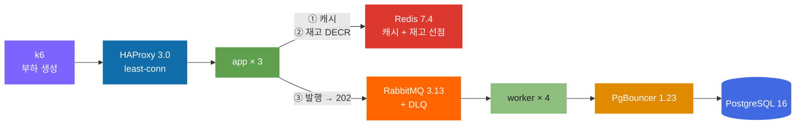

<div align="center">

<picture>
  <source media="(prefers-color-scheme: dark)" srcset="docs/assets/hero-dark.svg">
  
</picture>

<br>


[빠른 시작](#빠른-시작) · [배운 것](#배운-것) · [실험 기록](docs/labs/) · [최종 검증](docs/labs/09-final.md) · [클라우드 설계](docs/labs/10-cloud.md)

</div>

---

## 왜 만들었나

티켓 예약 API 하나를 놓고 계층을 하나씩 일부러 터뜨렸습니다. 로드밸런서, 앱 CPU, 커넥션 풀, 캐시, 큐 순서로요. 어디서 왜 무너지는지 매번 숫자로 남겼고, 그 기록이 [`docs/labs/`](docs/labs/)에 10편 있습니다.

목표는 처음부터 정해두고 시작했습니다.

```
1,000 RPS 지속 · p99 < 200ms · 에러율 < 0.1%
```

10단계 끝에 넘겼습니다.

| | Phase 01 | Phase 09 |
|---|--:|--:|
| 처리량 | 2,000 RPS에서 붕괴 | **1,005 RPS · 10분 지속** |
| p99 | — | **105ms** |
| 에러율 | — | **0.05%** |
| 앱 1대 강제 종료 | — | 18.3만 요청 중 실패 **2건** |

코드는 실험 도구에 가깝습니다. 진짜 결과물은 측정 기록 쪽이에요.

---

## 빠른 시작

macOS 기준입니다.

```bash
brew install colima docker docker-compose
```

VM 리소스는 고정해서 띄우는 걸 권합니다. 안 그러면 다음 주에 같은 숫자가 안 나옵니다.

```bash
colima start --cpu 6 --memory 8 --disk 60 --vm-type vz --mount-type sshfs
make up
```

| 주소 | 용도 |
|:--|:--|
| [localhost:8000/healthz](http://localhost:8000/healthz) | LB 경유 앱 상태 |
| [localhost:9090](http://localhost:9090) | Prometheus |
| [localhost:3001](http://localhost:3001) | Grafana |
| [localhost:15672](http://localhost:15672) | RabbitMQ 관리 (lts/lts) |

측정은 순서가 있습니다. `make sanity`부터 돌리세요.

```bash
make sanity                      # k6 자신의 상한부터 확인
./scripts/run-final.sh soak      # 1,000 RPS × 10분
```

`make sanity`에서 목표 RPS의 3~5배가 안 나오면, 그 뒤 숫자는 서버가 아니라 k6를 잰 겁니다.

<details>
<summary>Phase별 실험 재현하기</summary>

<br>

```bash
./scripts/run-app.sh   --list    # 04  앱서버 한계
./scripts/run-pool.sh  --list    # 05  커넥션 풀
./scripts/run-proxy.sh --list    # 06  PgBouncer
./scripts/run-cache.sh --list    # 07  캐시
./scripts/run-mq.sh    --list    # 08  메시지 큐
./scripts/run-final.sh soak|spike|fault   # 09

node scripts/capacity.mjs        # 리틀의 법칙 용량 산정
node scripts/analyze-final.mjs soak spike fault
```

각 단계 구성은 태그로 고정해뒀습니다.

```bash
git tag -n1
git checkout phase-05    # 그때 그 구성 그대로
```

</details>

---

## 배운 것

숫자는 전부 실측입니다. 근거는 링크한 문서에 있어요.

**처리량은 결국 CPU가 정합니다.** 요청당 CPU를 10ms 넣으면 100.20 RPS, 30ms면 34.30 RPS가 나왔습니다. 이론값 `1000/X`와 오차 3% 안이었고요. 그래서 같은 연산을 스레드풀로 옮겨봤더니 이벤트 루프 지연은 0이 됐는데 처리량은 34.3 → 24.1 RPS로 오히려 떨어졌습니다. 일을 다른 데로 보낸 것이지 없앤 게 아니니까요. ([04](docs/labs/04-app-server.md))

**빨리 거절하는 편이 낫습니다.** load shedding을 넣으니 실패율이 9.6% → 68.7%로 뛰었는데, 성공 처리량은 그대로면서 p50이 21,914ms → 493ms가 됐습니다. 실패율이 7배 는 게 개선이라는 게 좀 이상하게 들리지만, 21초 기다리다 떠난 사용자를 위해 서버가 계속 일하는 것보단 낫습니다. ([04](docs/labs/04-app-server.md))

**"풀이 마른다"는 증상이지 원인이 아니었습니다.** 200만 행 순차 스캔 하나가 커넥션 30개를 전부 묶어서 실패율 85.8%를 만들었는데, 풀은 손도 안 대고 인덱스 하나 추가하니 처리량 7.9배에 실패율 0%가 됐습니다. ([05](docs/labs/05-db-pool.md))

**앱 풀과 DB 프록시는 역할이 다릅니다.** 앱 6대 × 풀 20 = 120을 열려고 해도 PgBouncer를 끼우면 DB가 받는 건 22개로 고정됩니다. 같은 조건에서 직결은 상한 98개에 닿아 `too_many_clients` 47건이 났고요. ([06](docs/labs/06-db-proxy.md))

**로컬 캐시는 인스턴스가 늘수록 손해입니다.** 앱 3대가 각자 캐시를 가지니 같은 키에 miss가 3번 납니다. 균등 분포에서 로컬 hit ratio 37.6%, 공유 캐시 64.5%였습니다. ([07](docs/labs/07-cache.md))

**Stampede는 TTL이 짧아서 생기는 게 아닙니다.** TTL 1초에 지터를 0으로 둬도 스파이크가 안 났어요(1.05배). 키마다 캐시에 들어간 시각이 달라서 만료도 자연히 흩어지거든요. `FLUSHALL`로 동시 만료를 강제하니 그제서야 3.23배가 났습니다. ([07](docs/labs/07-cache.md))

**큐로 뺀다고 무조건 빨라지지 않습니다.** 저부하(600 RPS)에서는 p99가 95.87 → 233.56ms로 나빠졌습니다. DB 트랜잭션 1회(1.9ms)를 Redis + 브로커 왕복 2회로 바꾼 셈이니 당연했고요. 고부하(1,500 RPS)로 올리자 241.05 → 80.58ms로 3배 좋아졌습니다. ([08](docs/labs/08-mq.md))

**MQ의 진짜 대가는 성능이 아니라 약속입니다.** 응답이 `201 Created`(확정)에서 `202 Accepted`(접수)로 바뀝니다. 사용자에게 하는 말과 UI를 같이 바꿔야 해요. ([08](docs/labs/08-mq.md))

### 단계별 요약

| # | 주제 | 무엇을 터뜨렸나 | 결과 | |
|:--:|:--|:--|:--|:--:|
| 01 | 취약 기준선 | 튜닝 없이 한계까지 | 천장 2,000 RPS · 병목은 앱 단일 스레드 CPU (요청당 515µs) | [📄](docs/labs/01-baseline.md) |
| 02 | TLS 핸드쉐이크 | 세션 재사용 강제 해제 | 천장 절반으로 하락 · 프록시 오프로딩으로 회복 | [📄](docs/labs/02-tls.md) |
| 03 | 로드밸런서 | 알고리즘 교체 · 헬스체크 제거 | least-conn이 p99 7.4배 · drain 유무가 p99 45배 | [📄](docs/labs/03-loadbalancer.md) |
| 04 | 앱서버 한계 | CPU/메모리를 직접 태움 | 요청당 CPU가 천장 결정 · shedding이 p50 44배 단축 | [📄](docs/labs/04-app-server.md) |
| 05 | 커넥션 풀 | 풀을 양극단으로 + 락 경합 + 느린 쿼리 | 커넥션당 3.1MB 선형 · 인덱스 하나가 7.9배 | [📄](docs/labs/05-db-pool.md) |
| 06 | DB 프록시 | 앱 3→6대 + PgBouncer | DB 커넥션 22개 고정 · 메모리 53% 절감 | [📄](docs/labs/06-db-proxy.md) |
| 07 | 캐시 | 재고 희소화 + 로컬/Redis/2단 + stampede | DB 접촉 71% 감소 · 로컬이 hit 26.9%p 낮음 | [📄](docs/labs/07-cache.md) |
| 08 | 메시지 큐 | 쓰기를 큐 뒤로 + 3000 RPS 스파이크 | 고부하 p99 3배 · 스파이크 흡수(depth 1,833→8초) | [📄](docs/labs/08-mq.md) |
| 09 | 최종 검증 | 10분 soak · 2000 RPS 스파이크 · 앱 kill | 목표 전 항목 달성 | [📄](docs/labs/09-final.md) |
| 10 | 클라우드 설계 | 배포는 안 함. 설계만 | 지속 부하에선 상주가 2.5배 저렴 | [📄](docs/labs/10-cloud.md) |

---

## 최종 구조



요청 하나가 지나가는 길입니다.

```
1. HAProxy 가 least-conn 으로 앱 3대 중 하나에 보낸다
2. 앱이 Redis 캐시를 본다           → 매진이면 여기서 409 (DB 안 감)
3. 재고가 있으면 Redis DECR 로 선점  → 실패하면 409
4. 선점에 성공하면 큐에 발행하고 즉시 202 Accepted
5. 워커가 큐에서 꺼내 PgBouncer 를 거쳐 DB 에 반영
```

핵심은 **판정은 동기로, 반영은 비동기로** 자른 겁니다. 이렇게 안 하면 매진인데 202를 주고 나중에 취소를 통보하게 되는데, 티켓팅에서는 쓸 수 없는 설계죠.

각 선택의 근거는 [최종 검증 문서](docs/labs/09-final.md#1-최종-아키텍처)에 표로 정리해뒀습니다.

### 용량 산정

리틀의 법칙 `L = λ × W`에 앞선 단계의 실측치만 넣어 계산했습니다.

| 계층 | 계산 | 필요 | 실제 | 배수 |
|---|---|--:|--:|--:|
| 앱 CPU | `1000 ÷ (1÷515µs)` | 0.52 코어 | 6.0 | 11.5× |
| DB 커넥션 | `(1000×0.288) × 1.9ms` | 0.55개 | 22 | 40× |
| 워커 | `(1000×0.288) × 44.9ms ÷ 20` | 1대 | 4 | 4× |
| DB 메모리 | `10MB + 3.1MB × 22` | **78MB** | **79MB** | **1.01×** |

DB 메모리 회귀식은 Phase 05에서 뽑아 06과 09에서 다시 맞았습니다. 세 번 재현됐고 오차는 1~2%였어요.

### 최종 검증

| 시나리오 | 유지구간 RPS | p95 | p99 | 진짜 실패 |
|---|--:|--:|--:|--:|
| soak · 1,000 RPS × 10분 | 1,005.0 | 22.1ms | **105.0ms** | 300 (전부 시작 15초에) |
| spike · 0 → 2,000 RPS | 1,728.9 | 67.5ms | **182.0ms** | **0** |
| fault · 앱 1대 강제 종료 | 997.2 | 21.6ms | **49.5ms** | **2** |

앱 1대를 죽였는데 18.3만 요청 중 실패가 2건이었습니다. HAProxy 헬스체크가 2초 안에 감지해서 나머지 2대로 넘겼거든요.

여기서 "진짜 실패"는 무응답 + 502 + 503 + 504만 센 겁니다. 409 매진은 정상 거절이라 뺐어요. 티켓이 잘 팔릴수록 실패율이 오르면 지표로서 의미가 없으니까요.

---

## 삽질 기록

관측 도구가 측정을 두 번 죽였습니다. 아마 이 프로젝트에서 제일 오래 기억에 남을 것 같네요.

```
Phase 02  cAdvisor 가 컨테이너 라벨로 시계열을 폭발시켜 Prometheus OOM
Phase 07  k6 가 요청 URL 을 라벨로 붙여 시계열 154만 개 → Prometheus OOM
```

Phase 07에서는 실험 12개가 통째로 날아갔습니다. `name` 태그를 고정하고 `url`을 `systemTags`에서 빼자 154만 → 2,901개로 줄었고요.

나머지도 비슷한 종류였습니다.

| 증상 | 원인 | 교훈 |
|---|---|---|
| 실패율 100% | k6 `expectedStatuses`에 202 없음 | 새 상태코드를 쓰면 k6 설정도 같이 고친다 |
| 실험 1h43m 정지 | `docker compose exec`이 절전 후 무한 대기 | 모든 대기에 상한을 둔다 |
| 워커 지표 전무 | 설정 추가 후 Prometheus 미재시작 | 설정을 고쳤으면 다시 읽었는지 확인한다 |
| RPS가 `—` | 분석기가 로그를 `latin1`로 읽음 | 한글 로그는 `utf8` |
| 커넥션당 30MB? | `VmRSS` 합산은 공유 메모리를 중복 계산 | 사적 메모리는 `RssAnon` |

---

## 아직 못 한 것

틀린 가설이나 미측정 항목은 지우지 않고 그대로 뒀습니다.

- **메모리 누수는 판정 보류입니다.** 10분 soak에서 힙 기울기가 +0.64MB/분이었는데, 워밍업 잔여인지 느린 누수인지 10분으로는 구분이 안 됩니다. 1시간 이상 돌려봐야 해요.
- **진짜 처리량 천장은 안 재봤습니다.** 1,500 RPS를 요청했고 그만큼 나왔을 뿐입니다. CPU는 6코어 중 2.4코어만 썼으니 여유가 있었고요.
- **Phase 08에서 숫자를 잘못 읽었습니다.** "1,189 RPS에서 멈췄다"고 썼는데 워밍업이 섞인 평균이었어요. [해당 문서에 정정을 달아뒀습니다](docs/labs/08-mq.md).

---

## 기록 방식

lab 문서는 전부 같은 여섯 섹션으로 씁니다.

```
가설       실험 전에 쓴다. 나중에 고치지 않는다 — 틀린 가설도 그대로 남긴다
설정       남이 그대로 재현할 수 있을 만큼
측정결과    k6 원문 요약. 손으로 다시 쓰지 않는다
병목 원인   어떤 근거로 그 결론에 도달했는지. 근거 없는 추정 금지
개선       무엇을 왜 바꿨는가. 버린 대안과 그 이유도
재측정      개선 전/후를 나란히. 개선 안 됐으면 그것도 그대로
```

지킨 규칙은 넷입니다.

1. **한 번에 한 계층만 건드린다** — 두 계층을 같이 바꾸면 원인을 못 가린다
2. **가설은 실험 전에 쓰고 틀려도 고쳐 쓰지 않는다** — 틀린 가설이 남아야 기록이다
3. **성능 수치는 추측하지 않는다** — 실제 k6 출력만 근거로 쓴다
4. **부하 생성기가 병목이 아님을 매번 확인한다** — "서버가 한계"가 아니라 "내 노트북이 한계"인 경우가 제일 흔하다

자세한 건 [docs/conventions.md](docs/conventions.md)에 있습니다.

---

## 저장소 구조

```
app/            Fastify + Drizzle 앱
  ├ cache.js      로컬/Redis/2단 캐시 + singleflight + 재고 선점(DECR)
  ├ queue.js      RabbitMQ 발행 + 재연결 + DLQ/재시도 토폴로지
  ├ worker.js     컨슈머. 차감+INSERT 를 한 트랜잭션에 묶어 멱등성 확보
  ├ overload.js   부하 주입 + 과부하 보호 (shedding/bulkhead/timeout)
  └ reservation.js  대상 라우트
k6/             부하 스크립트 (final.js = Phase 09 시나리오 3종)
scripts/        단계별 실행 래퍼 + 분석기 + 용량 산정
docs/labs/      실험 기록 10편 — 이 저장소의 본체
docs/slo.md     SLO/SLI 정의와 알람 임계치
results/        k6 원본 출력 (git 미추적)
```

---

## 알려진 제약

k6와 서버가 같은 VM에서 돕니다. CPU를 나눠 쓰니 `make sanity`로 생성기 여유를 매번 확인해야 해요. Phase 08의 `spike-async-w4`에서 실제로 호스트 CPU 경합이 결과를 오염시켰습니다.

측정 중에는 절전을 피하세요. `docker compose exec`이 절전에서 깨어나면 무한 대기에 빠집니다. Phase 08에서 두 번(1h43m + 1h4m) 멈췄습니다.

iCloud 동기화 폴더 아래에 두면 곤란합니다. 디스크가 부족할 때 macOS가 파일을 dataless로 내보내서 컨테이너 마운트가 `Resource deadlock would occur`로 실패합니다.

디스크 여유도 넉넉히 두세요. Phase 04에서 디스크가 가득 차 containerd 이미지 저장소가 손상됐습니다(`input/output error`).

---

<div align="center">
<sub>실험 기록 <a href="docs/labs/">docs/labs/</a> · 작업 규칙 <a href="docs/conventions.md">docs/conventions.md</a></sub>
</div>
