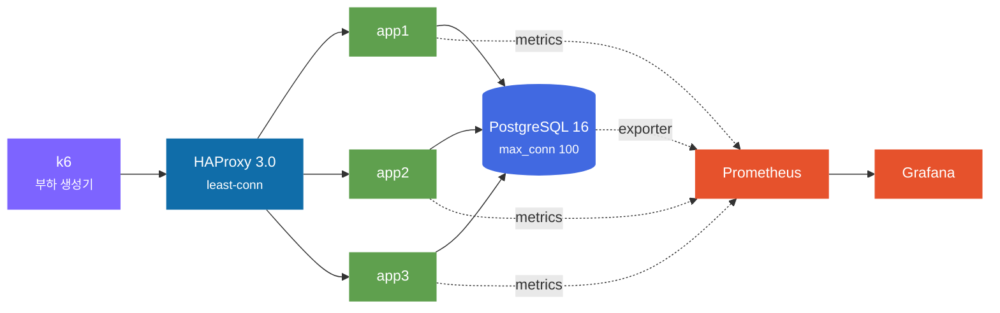

<div align="center">

<picture>
  <source media="(prefers-color-scheme: dark)" srcset="docs/assets/hero-dark.svg">
  
</picture>

<br>


**[실험 기록](docs/labs/)** · **[빠른 시작](#-빠른-시작)** · **[발견한 것](#-지금까지-발견한-것)** · **[작업 규칙](CLAUDE.md)**

</div>

---

## 이 저장소는 무엇인가

k6 → 로드밸런서 → 앱서버 → DB 구조를 로컬 Docker Compose 위에 세워두고, **단 하나의 라우트**를 계층별로 일부러 터뜨려가며 백엔드 병목을 찾는 학습 프로젝트입니다.

**진짜 산출물은 코드가 아니라 [`docs/labs/`](docs/labs/) 의 측정 기록입니다.** 코드는 실험 도구일 뿐입니다. 성능 좋은 서버를 만드는 게 목적이 아니라, "왜 여기서 막히는지"를 숫자로 남기는 게 목적이거든요.

그래서 규칙이 좀 빡빡합니다.

> **① 한 번에 한 계층만 건드린다** — 두 계층을 같이 바꾸면 원인 귀속이 불가능해집니다
> **② 가설은 실험 전에 쓰고, 틀려도 고쳐 쓰지 않는다** — 틀린 가설이 남아야 학습 기록입니다
> **③ 성능 수치는 추측하지 않는다** — "보통 이 정도 나온다" 금지. 실제 k6 출력만 근거로 씁니다
> **④ 부하 생성기가 병목이 아님을 매번 확인한다** — 로컬 부하테스트에서 가장 흔한 거짓 결론이 "서버가 한계"가 아니라 "내 노트북이 한계"입니다

---

## 대상 라우트

**라우트는 하나뿐입니다.** 추가하고 싶어지면 그건 대개 실험 설계가 잘못된 겁니다.

```http
POST /api/v1/events/{eventId}/reservations
```

읽기(잔여 수량 조회)와 쓰기(재고 차감 + 예약 생성)를 **한 트랜잭션 안에** 넣었습니다. 커넥션 풀·행 락·캐시 일관성·비동기 분리를 전부 이 라우트 하나로 실험할 수 있게요.

핵심 파라미터는 **핫키 비율(`HOT_RATIO`)** 입니다. 부하가 특정 이벤트 하나에 몰리는 정도를 조절해 락 경합을 켜고 끕니다.

### 목표 SLO

| 지표 | 목표 |
|:--|--:|
| 처리량 | **1,000 RPS** 지속 |
| 지연 | **p99 < 200ms** |
| 에러율 | **< 0.1%** |

---

## 아키텍처



| 계층 | 선택 | 비고 |
|:--|:--|:--|
| 런타임 | colima (Lima + vz) | VM **6 CPU / 8GB** 고정 |
| 앱 | Node 24 · Fastify 5 · Drizzle ORM · node-postgres | Phase 03부터 3대 |
| DB | Postgres 16-alpine | 설정 무수정 (풀 기본값 10) |
| LB | HAProxy 3.0 | nginx는 Phase 02 TLS 종료용으로만 |
| 부하 | k6 0.56 | open model (`ramping-arrival-rate`) |
| 관측 | Prometheus · Grafana · postgres_exporter | 앱은 1초 해상도 |

<details>
<summary><b>왜 Prisma 대신 Drizzle 인가</b></summary>

<br>

커넥션 풀(node-postgres)이 그대로 노출돼서 `totalCount` / `idleCount` / `waitingCount` 와 획득 대기시간을 직접 계측할 수 있습니다. 이 프로젝트는 풀 내부를 들여다보는 게 핵심이라 추상화가 얇은 쪽이 맞았습니다.

</details>

<details>
<summary><b>왜 cAdvisor 를 뺐나</b></summary>

<br>

colima 환경에서 컨테이너 이름 라벨이 안 붙었고, 대량 시계열로 Prometheus를 OOM 시켰습니다. 자세한 건 [`02-tls.md`](docs/labs/02-tls.md) 에 기록해뒀습니다.

</details>

---

## 지금까지 발견한 것

<div align="center">

<picture>
  <source media="(prefers-color-scheme: dark)" srcset="docs/assets/roadmap-dark.svg">
  
</picture>

</div>

### 핵심 발견 넷

> **처리량은 CPU가 정한다.** 요청당 CPU를 10ms 넣으면 100.20 RPS, 30ms 넣으면 34.30 RPS가 나옵니다. 이론값 `1000/X` 와 오차 3% 안에서 일치했습니다.

> **비동기로 옮겨도 CPU가 없으면 소용없다.** 같은 연산을 스레드풀로 보내니 이벤트 루프 지연은 0이 됐지만 처리량은 34.3 → 24.1 RPS로 **떨어졌습니다.** 일을 다른 데로 보낸 것이지 없앤 게 아니니까요.

> **빨리 거절하는 게 느려지는 것보다 낫다.** load shedding을 넣자 실패율이 9.6% → 68.7%로 늘었는데, 성공 처리량은 그대로면서 p50이 **21,914ms → 493ms** 가 됐습니다. 실패율이 7배 늘어난 게 개선입니다.

> **타임아웃만으로는 최악이다.** 실패율 99.8%. 응답은 포기해도 서버는 그 요청의 CPU 연산을 계속 돌립니다. 자원을 다 쓰고도 전부 실패했습니다.

### Phase 별 결과

| # | 주제 | 무엇을 터뜨렸나 | 결과 | 기록 |
|:--:|:--|:--|:--|:--:|
| **01** | 취약 기준선 | 튜닝 없이 한계까지 밀어붙임 | 천장 **2,000 RPS** · 병목 = 앱 단일 스레드 CPU (요청당 515µs) | [📄](docs/labs/01-baseline.md) |
| **02** | TLS 핸드쉐이크 | 세션 재사용을 강제로 끔 | 천장 **절반**으로 하락 · 프록시 오프로딩으로 회복 | [📄](docs/labs/02-tls.md) |
| **03** | 로드밸런서 | 알고리즘 교체 · 헬스체크 제거 | least-conn이 p99 **7.4배** 개선 · drain 유무가 p99 **45배** | [📄](docs/labs/03-loadbalancer.md) |
| **04** | 앱서버 한계 | CPU/메모리를 직접 태움 (`cpus=1.0`) | 요청당 CPU가 천장 결정 · shedding이 p50 **44배** 단축 | [📄](docs/labs/04-app-server.md) |
| 05 | 커넥션 풀 | — | 예정 | |
| 06 | DB 프록시 | — | 예정 | |
| 07 | 캐시 | — | 예정 | |
| 08 | 메시지 큐 | — | 예정 | |
| 09 | 클라우드 확장 | — | 예정 | |

<details>
<summary><b>Phase 04 전체 측정표 보기</b></summary>

<br>

CPU 30ms · 120 RPS 유입 · `cpus=1.0` `mem=512m` 고정.

| 구성 | 성공 RPS | p50 | p99 | 실패율 | 실패 종류 |
|:--|--:|--:|--:|--:|:--|
| 무보호 | 33.9 | 21,914ms | 60,029ms | 9.6% | 응답 없음 |
| 타임아웃 500ms | 0.1 | 2,768ms | 59,997ms | **99.8%** | 504 + 응답 없음 |
| **bulkhead 50** | **34.0** | **88ms** | 5,662ms | 70.6% | 503 |
| **load shedding** | **35.8** | **493ms** | **2,934ms** | 68.7% | 503 |
| 전부 (워커4 포함) | 30.8 | 572ms | 3,408ms | 71.6% | 503 + 504 |

성공 처리량이 전부 33~36 RPS로 같습니다. **이론 용량(33 RPS)과 일치합니다.** 보호 장치는 처리량을 늘리지 않습니다 — 남는 부하를 줄 세울지 돌려보낼지만 바꿉니다.

</details>

---

## 🚀 빠른 시작

### 준비 (macOS)

```bash
brew install colima docker docker-compose
```

`~/.docker/config.json` 에 compose 플러그인 경로를 등록해야 `docker compose` 가 동작합니다.

```json
{ "cliPluginsExtraDirs": ["/opt/homebrew/lib/docker/cli-plugins"] }
```

VM은 **반드시 리소스를 고정**해서 띄웁니다. 재현성이 여기서 갈립니다.

```bash
colima start --cpu 6 --memory 8 --disk 60 --vm-type vz --mount-type sshfs
```

### 실행

```bash
make up
```

| 주소 | 용도 |
|:--|:--|
| [localhost:3000/healthz](http://localhost:3000/healthz) | 앱 상태 |
| [localhost:3000/metrics](http://localhost:3000/metrics) | 앱 Prometheus 지표 |
| [localhost:9090](http://localhost:9090) | Prometheus |
| [localhost:3001](http://localhost:3001) | Grafana |

### 측정

**반드시 이 순서로 합니다.**

```bash
make sanity
```

DB를 타지 않는 라우트로 **k6 자신의 상한**부터 잽니다. 여기서 목표 RPS의 3~5배가 안 나오면, 이후 모든 숫자는 서버가 아니라 k6를 잰 것입니다.

```bash
make breaking
```

주 시나리오. open model(`ramping-arrival-rate`)로 RPS를 계단식으로 올려 breaking point를 찾습니다.

```bash
make closed
```

대조군. closed model(`ramping-vus`)로 같은 서버를 잽니다. **측정 방법이 결과를 어떻게 바꾸는지** 보려는 겁니다.

```bash
node scripts/analyze.mjs breaking-point
```

각 계단의 유지구간만 잘라 앱/풀/DB 지표를 표로 뽑습니다. k6 요약은 런 전체를 뭉갠 숫자라 "몇 RPS에서 무엇이 먼저 터졌는지"를 알 수 없거든요.

<details>
<summary><b>Phase 04 실험 재현하기</b></summary>

<br>

```bash
./scripts/run-app.sh a-cpu30       # 요청당 CPU 30ms 주입
./scripts/run-app.sh fix-shed      # load shedding 적용
node scripts/analyze-app.mjs a-cpu30 fix-shed
```

실험 이름 전체는 [`scripts/run-app.sh`](scripts/run-app.sh) 안에 있습니다.

</details>

---

## 실험 기록 규격

모든 lab 문서는 **여섯 섹션을 이 순서로** 갖습니다.

```
가설       무엇이 병목이라 보는가. 실험 전에 쓴다. 나중에 고치지 않는다
설정       변경한 값과 변경하지 않은 값. 남이 그대로 재현할 수 있을 만큼
측정결과    k6 원문 요약. 손으로 다시 쓰지 않는다
병목 원인   어떤 근거로 그 결론에 도달했는지. 근거 없는 추정 금지
개선       무엇을 왜 바꿨는가. 버린 대안과 그 이유도
재측정      개선 전/후를 나란히. 개선 안 됐으면 그것도 그대로
```

Phase 완료 시 `git tag phase-NN` 을 남깁니다. 태그 메시지에 도달한 RPS / p99 / 에러율을 적어서, 나중에 "그때 그 구성"을 그대로 재현할 수 있게 합니다.

```bash
git tag -n1
```

---

## 저장소 구조

```
app/            Fastify + Drizzle 앱
  ├ overload.js   부하 주입 + 과부하 보호 (shedding/bulkhead/timeout)
  ├ main.js       cluster 진입점 — 워커별 지표 포트로 파편화 회피
  └ reservation.js  대상 라우트의 트랜잭션
db/             스키마·시드(init.sql), 실행 간 초기화(reset.sql)
k6/             부하 스크립트 + 공용 헬퍼
haproxy/        LB 설정 (알고리즘·헬스체크 실험용)
prometheus/     스크레이프 설정 (앱은 1초 해상도)
grafana/        데이터소스·대시보드 프로비저닝
scripts/        실행 래퍼, 계단별 분석기, 에셋 생성기
docs/labs/      ★ 실험 기록 — 이 프로젝트의 진짜 산출물
results/        k6 원본 출력 (git 미추적)
```

---

## 알려진 환경 제약

**k6와 서버가 같은 VM 안에서 돕니다.** CPU를 나눠 쓰므로 `make sanity` 로 생성기 여유를 매번 확인해야 합니다.

**iCloud 동기화 폴더 아래에 두면 안 됩니다.** 저장소가 `~/Desktop` 아래에 있으면 디스크가 부족할 때 macOS가 파일을 dataless로 내보내고, 컨테이너 마운트 읽기가 `Resource deadlock would occur` 로 실패합니다. `scripts/run-k6.sh` 가 실행 전에 강제 실체화하지만, 근본 해결은 저장소를 동기화 대상 밖으로 옮기는 것입니다.

**디스크 여유를 넉넉히 두세요.** Phase 04 도중 디스크가 가득 차 containerd 이미지 저장소가 파일시스템 수준에서 손상됐습니다(`input/output error`). VM 재기동으로 복구했지만 일부 Prometheus 시계열은 잃었습니다. 디스크 고갈은 "공간이 없다"로 끝나지 않고 데이터를 망가뜨립니다.

---

<div align="center">
<sub>실험 기록은 <a href="docs/labs/">docs/labs/</a> 에 있습니다 · 작업 규칙은 <a href="CLAUDE.md">CLAUDE.md</a></sub>
</div>
