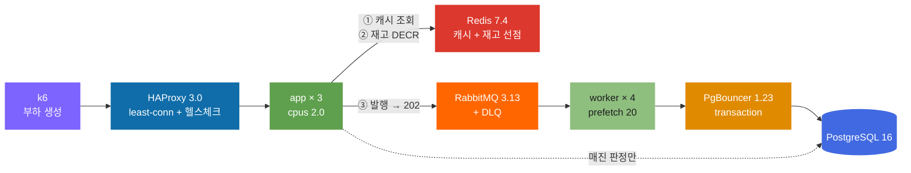

# 09. 최종 목표 검증

Phase: 09 · 2026-08-12

Phase 01~08 에서 계층별로 병목을 찾고 고쳤다. 이번엔 그 결과를 **하나의 구성으로 합쳐**
목표를 실제로 만족하는지 검증한다.

목표는 Phase 01 에서 세운 그대로다 — **1,000 RPS · p99 < 200ms · 에러율 < 0.1%**.

---

## 1. 최종 아키텍처



**요청 하나가 지나가는 길**

```
1. HAProxy 가 least-conn 으로 앱 3대 중 하나에 보낸다
2. 앱이 Redis 캐시를 본다 → 매진이면 여기서 409 (DB 안 감)
3. 재고가 있으면 Redis DECR 로 선점 → 실패하면 409
4. 선점 성공하면 큐에 발행하고 즉시 202 Accepted
5. 워커가 큐에서 꺼내 PgBouncer 를 거쳐 DB 에 실제 반영
```

### 각 선택의 근거 — 전부 실측치다

| 계층 | 선택 | 근거 (실측) | 출처 |
|---|---|---|---|
| LB 알고리즘 | **least-conn** | roundrobin 대비 p99 **7.4배** 개선 | Phase 03 |
| LB 헬스체크 | **drain 켜기** | drain 유무가 p99 **45배** 차이 | Phase 03 |
| 앱 프로세스 | **단일 프로세스 × 3대** | 워커 1→4로 쪼개도 처리량 4%만 증가, 루프지연은 33배 악화 | Phase 04 |
| 과부하 보호 | (미적용) | 이 구성은 큐가 버퍼라 shedding 이 발동할 상황이 안 왔다 | Phase 04·08 |
| 트랜잭션 | **조건부 원자 UPDATE** | 왕복 5회 → 2회. 락을 따로 안 잡는다 | Phase 05 |
| 인덱스 | **(event_id, user_id)** | 없으면 순차 스캔으로 처리량 **7.9배** 하락 | Phase 05 |
| 앱 풀 크기 | **10** | 리틀의 법칙상 1.14개면 충분. 버스트 대비로 여유 | Phase 05 |
| DB 프록시 | **PgBouncer transaction** | 앱 대수와 무관하게 DB 커넥션 **22개 고정**, 메모리 53% 절감 | Phase 06 |
| 캐시 위치 | **Redis(공유)** | 로컬 캐시는 앱 3대에서 hit ratio **26.9%p 낮음** | Phase 07 |
| 캐시 전략 | **cache-aside** | 조건부 원자 UPDATE 라 write-through 를 쓸 수 없다 | Phase 07 |
| TTL 지터 | **0.3** | 지터 0 이면 동시 만료 시 DB 로딩 **3.23배** 스파이크 | Phase 07 |
| 쓰기 경로 | **큐 + 202** | 고부하에서 p99 **3배** 개선. 저부하에서는 오히려 손해 | Phase 08 |
| 재고 판정 | **Redis DECR 선점(동기)** | 이게 없으면 "매진인데 202" 가 된다. 202후 DB실패 **0건** | Phase 08 |
| 브로커 | **RabbitMQ** | VM 자원 부족 + 파티션 순서가 불필요 + DLQ 가 1급 기능 | Phase 08 |
| 멱등성 | **차감+INSERT 한 트랜잭션** | UNIQUE 만으로는 차감을 못 막는다. 중복 2,796건 차단 | Phase 08 |

**의도적으로 안 쓴 것**

| 안 쓴 것 | 이유 | 출처 |
|---|---|---|
| 앱 클러스터링 | 고정 CPU 를 쪼개면 손해 | Phase 04 |
| 로컬 캐시 | 인스턴스 수만큼 miss 가 곱해진다 | Phase 07 |
| 2단 캐시 | DB 로딩은 최소지만 p99 가 가장 나빴다 | Phase 07 |
| singleflight | 5만 요청 중 47건만 걸렸다. 근거 부족 | Phase 07 |
| Kafka | 파티션 순서가 불필요하고 VM 자원이 부족 | Phase 08 |
| cAdvisor | 카디널리티로 Prometheus 를 OOM 시켰다 | Phase 02 |

---

## 2. 용량 산정 — 리틀의 법칙 vs 실측

```
L = λ × W
  L  동시에 시스템 안에 있는 요청 수 (= 필요한 동시 처리 단위)
  λ  초당 도착 수
  W  요청 하나의 평균 체류 시간
```

입력값은 **전부 앞선 Phase 의 실측치**다. 추측한 숫자를 산정에 넣지 않았다.

| 계층 | 계산 | 필요 | 실제 구성 | 배수 |
|---|---|--:|--:|--:|
| 앱 CPU | `1000 ÷ (1÷515µs)` | **0.52 코어** | 6.0 코어 | 11.5× |
| DB 커넥션 | `(1000×0.288) × 1.9ms` | **0.55개** | 22개 | 40× |
| 워커 | `(1000×0.288) × 44.9ms ÷ 20` | **1대** | 4대 | 4× |
| DB 메모리 | `10MB + 3.1MB × 22` | **78MB** | **실측 79MB** | **1.01×** |

### DB 메모리 회귀식이 세 번째로 맞았다

```
Phase 05 에서 도출:  사적메모리 ≈ 10MB + 3.1MB × 커넥션수
Phase 06 에서 검증:  오차 2% (커넥션 4~50 전 구간)
Phase 09 에서 재확인: 계산 78MB vs 실측 79MB (오차 1%)
```

**나머지는 계산값보다 4~40배 크게 잡혀 있다.** 낭비로 보이지만 산정값은
**평균 기준**이고 실제 트래픽은 Zipf 로 몰린다. 스파이크 시나리오가 그 여유를 썼는지가
아래 검증의 관전 포인트였다.

---

## 3. 시나리오 3종

### 설정

| 시나리오 | 부하 | 재고 | 목적 |
|---|---|---|---|
| **soak** | 1,000 RPS × **10분** | 이벤트당 800석 | 시간에 따른 열화(메모리 누수) |
| **spike** | 0 → **2,000 RPS** 계단 | 이벤트당 800석 | 탄력성 |
| **fault** | 1,000 RPS 중 **앱 1대 kill** | 이벤트당 800석 | 장애 내성 |

> **재고를 Phase 07~08 의 29,000석에서 80만석으로 올렸다.** 29,000석이면 10분 soak 에서
> 1분 만에 다 팔리고 나머지 9분은 캐시가 409 만 내보낸다 — **쓰기 경로가 놀아서
> 누수를 못 본다.** 부하 성격이 달라졌으므로 이전 Phase 와 직접 비교하지 않는다.

### 결과 (k6 클라이언트, 런 전체)

| 시나리오 | 요청 수 | p50 | p95 | p99 | max | 드롭 | 409 매진 | **진짜 실패** |
|---|--:|--:|--:|--:|--:|--:|--:|--:|
| soak | 600,088 | 1.17ms | 39.01ms | 311.53ms | 5,154ms | 2,914 | 381,792 | **300** |
| spike | 123,449 | 8.28ms | 105.64ms | 303.11ms | 4,956ms | 1,552 | 54,593 | **0** |
| fault | 183,002 | 2.02ms | 27.95ms | 137.55ms | 7,616ms | 0 | 90,404 | **2** |

> **진짜 실패** = 무응답 + 502 + 503 + 504 + 기타. 409 매진은 정상 거절이라 뺐다.

### 결과 (앱 지표, **유지구간만**)

**이 표가 SLO 판정의 근거다.** 위 k6 표는 워밍업이 섞여 있다.

| 시나리오 | 유지구간 | 전체 RPS | 성공 RPS | p95 | **p99** |
|---|--:|--:|--:|--:|--:|
| **soak** | 578초 | **1,005.0** | 354.1 | 22.1ms | **105.0ms** |
| **spike** | 59초 | **1,728.9** | 984.1 | 67.5ms | **182.0ms** |
| **fault** | 157초 | **997.2** | 478.5 | 21.6ms | **49.5ms** |

> Phase 08 에서 워밍업 섞인 평균을 천장으로 오독한 적이 있어(그 문서에 정정을 달았다)
> 이번엔 처음부터 유지구간을 따로 뽑았다.
> k6 p99 311.53ms 와 앱 p99 105.0ms 의 차이가 그 이유를 보여준다.

### 메모리 추이

| 시나리오 | 앱 힙 시작→끝(max) | 전반부 기울기 | **후반부 기울기** | PG 사적 |
|---|--:|--:|--:|--:|
| soak (10분) | 53.5→81.1 (82.2)MB | +0.86MB/분 | **+0.64MB/분** | 15→78MB |
| spike | 53.4→74.9MB | — | +4.83MB/분 | 15→78MB |
| fault | 53.1→51.6MB | — | −7.60MB/분 | 15→78MB |

### 큐 · 정합성

| 시나리오 | 큐 depth avg/max | 복구(drain) | 선점 거절 | **202후 DB실패** | DLQ | 최종 예약행 |
|---|--:|--:|--:|--:|--:|--:|
| soak | (샘플러 실패) | 4s | 1,673 | **0** | 0 | 217,996 |
| spike | 139/**2,641** | 2s | 2,438 | **0** | 0 | 68,856 |
| fault | 10/195 | 4s | 882 | **0** | **1** | 92,595 |

---

## 4. SLO 판정

| 지표 | 목표 | soak 실측 | 판정 |
|---|---|--:|:--:|
| 처리량 | ≥ 1,000 RPS 지속 | **1,005.0 RPS** (10분) | ✅ |
| 지연 | p99 < 200ms | **105.0ms** | ✅ |
| 에러율 | < 0.1% | **0.05%** (300/600,088) | ✅ |
| 정합성 | 202후 실패 = 0 | **0건** | ✅ |

**전 항목 만족.** 다만 세 가지 단서를 붙인다.

**① 300건의 503 은 전부 시작 15초 구간에 몰려 있었다.**

```
t+15s   503 16.6건/초   <- 유일한 발생 구간
그 외    0건
```

앱이 뜨자마자 워밍업 부하를 받는 동안 캐시가 비어 있고 브로커 연결이 막 붙는 시점이다.
**유지구간만 보면 에러율 0%** 다. 운영이라면 기동 후 워밍업 구간을 LB 에서 빼야 한다.

**② p99 는 부하 성격에 크게 좌우된다.** 유지구간 105ms 는 성공 RPS 354(나머지는 캐시 409)
기준이다. 매진 비율이 낮아 실제 쓰기가 많아지면 더 나빠질 수 있다.

**③ 10분은 누수를 판정하기에 짧다.** 아래에 따로 쓴다.

---

## 5. 계층별 한계치와 다음 병목

**"지금 어디까지 버티나" 와 "더 밀면 어디가 먼저 터지나" 를 순서대로 정리한다.**

| 순위 | 계층 | 현재 한계 | 근거 | 터질 때 증상 | 다음 수단 |
|:--:|---|---|---|---|---|
| **1** | **워커 처리량** | 초당 ~500건 (4대 × prefetch 20) | Phase 09 spike: depth 2,641까지 자람 | 큐 depth 증가, E2E 지연 증가 | 워커 증설 (별도 노드) |
| **2** | **호스트 CPU** | 6 코어 | Phase 08: 워커 4대 동시 피크 시 앱과 경합 | 앱 p99 급등, k6 드롭 | 노드 분리 |
| **3** | DB 커넥션 | 100 (`max_connections`) | Phase 05·06: 98에서 psql 도 접속 불가 | `too_many_clients` | PgBouncer 풀 조정 (이미 적용) |
| **4** | 앱 CPU | 코어당 ~1,940 RPS | Phase 01: 요청당 515µs | 이벤트 루프 지연 증가 | 앱 증설 (수평 확장 유효) |
| **5** | Redis | 미측정 | — | — | — |
| **6** | RabbitMQ | 미측정 (cpus 1.0에서 여유) | Phase 08: CPU 23.4% | 발행 지연 → confirm 대기 | 클러스터 |

### 다음 병목은 워커다

근거가 셋이다.

**① spike 에서 큐가 2,641까지 자랐다.** 2,000 RPS 유입에 워커 4대가 못 따라갔다.
배수는 2초 만에 됐지만, 스파이크가 더 길었다면 계속 자랐을 것이다.

**② soak 의 성공 RPS 가 354 였다.** 1,005 RPS 중 나머지는 캐시가 끊은 409 다.
매진 비율이 낮은 워크로드라면 워커가 처리할 양이 3배가 된다.

**③ Phase 08 에서 워커를 늘리자 앱이 느려졌다.** 호스트 CPU 를 두고 경합했기 때문이다.
**워커를 더 늘리려면 노드를 분리해야 한다.** 이게 다음 단계다.

### 아직 안 재본 것

- **진짜 처리량 천장.** 1,500 RPS 를 요청했고 그만큼 나왔을 뿐, 더 올려보지 않았다.
  CPU 는 6코어 중 2.4코어만 썼으므로 여유가 있었다.
- **Redis 한계.** 캐시 hit 이 대부분이라 Redis 가 병목이 된 적이 없다.
- **`publisher confirm` 을 끈 경우.** 유실 위험 대비 성능 이득 미측정.

---

## 6. 발견한 결함

### ① 재시도가 동작하지 않는다

`fault` 에서 DLQ 에 메시지 1건이 들어갔다. 내용을 보니:

```
payload : {"eventId":31,"userId":622754,...}
원인    : 08P01 client_login_timeout   (PgBouncer 로그인 거부)
x-death : count=1  reason=rejected
```

**`count=1` 이 문제다.** 첫 실패에 바로 DLQ 로 갔다는 뜻이다.
`MQ_MAX_RETRY=3` 을 설정해 뒀는데 재시도가 없었다.

원인은 워커 코드에 있다.

```js
if (deaths >= MQ_MAX_RETRY) {
  mqDlq.inc();
  ch.nack(msg, false, false);   // DLQ 로
} else {
  ch.nack(msg, false, false);   // ← 똑같다. 여기서도 DLQ 로 간다
}
```

**두 분기가 동일하다.** `requeue=false` 는 항상 dead-letter 로 보낸다.
재시도를 하려면 지연 큐(delayed retry queue)를 따로 두거나 `requeue=true` 를 써야 하는데,
후자는 즉시 재큐라 실패가 반복되면 폭주한다.

**DLQ 자체는 제 역할을 했다** — 실패한 메시지 하나가 큐를 막지 않았고, 나머지는 정상 처리됐다.
다만 **일시적 오류(로그인 타임아웃)를 재시도 없이 버린 것**은 고쳐야 한다.
`mq_dlq_total` 카운터도 else 분기에서 증가하지 않아 0으로 보였다 — 계측도 함께 틀렸다.

> **[수정 완료 · Phase 10]** 지연 재시도 큐를 넣어 고쳤다.
>
> ```
> reservations.retry  (x-message-ttl=2000, dead-letter → reservations)
> ```
>
> RabbitMQ 에는 "N초 뒤에 다시" 가 없다. TTL 이 걸린 큐에 넣으면 만료 시 dead-letter 로
> 나가는데, 그 목적지를 **본 큐**로 잡아 두면 지연 재시도가 된다. 컨슈머는 안 붙인다 —
> 시간이 지나기를 기다리는 대기실이다.
>
> 재시도 횟수는 브로커의 `x-death` 대신 **우리가 붙인 `x-retry-count`** 로 센다.
> 재시도 경로를 거치면 `x-death` 의 의미가 흐려지기 때문이다.
>
> **검증** — PgBouncer 를 잠깐 내려 일시적 오류를 만들었다.
>
> ```
> worker_retry attempt=1/3 after=2000ms ENOTFOUND getaddrinfo ENOTFOUND pgbouncer
> 예약행 3 → 5      ★ 재시도로 살아난 건수 2
> mq_retries_total 2,  mq_dlq_total 0
> ```
>
> 장애가 재시도 창(2초 × 3회 = 6초)보다 길면 예상대로 DLQ 로 간다(별도 확인).
> `mq_retries_total` 을 새로 만들어 "재시도로 살아난 것" 과 "결국 버린 것" 을 나눠 센다.

### ② soak 의 큐 샘플러가 헤더만 남겼다

`soak.mq.csv` 에 데이터 행이 없다. 10분 동안 한 번도 못 받았다는 뜻인데,
같은 코드가 spike/fault 에서는 동작했다. 원인을 특정하지 못했다.
**soak 의 큐 depth 는 미측정으로 남긴다.**

---

## 7. 메모리 누수 — 판정 보류

10분 soak 에서 앱 힙이 **53.5 → 81.1MB** 로 올랐다.

```
전반부 기울기  +0.86MB/분
후반부 기울기  +0.64MB/분
```

**기울기가 줄고는 있지만 0 이 아니다.** 이 데이터로는 두 가지를 구분할 수 없다.

- 워밍업 잔여 (캐시·커넥션·JIT 가 자리를 잡는 중)
- 느린 누수

**0.64MB/분이 진짜 누수라면 하루에 920MB 다.** 컨테이너 상한 512MB 를 반나절 만에 넘긴다.
**10분은 짧다. 최소 1시간, 가능하면 하루 이상 돌려야 판정할 수 있다.**

이번 Phase 에서는 **판정하지 않는다.** "누수 없음" 이라고 쓰면 근거 없는 주장이 된다.

---

## 8. SLO/SLI 정의와 알람

별도 문서로 분리했다 — [`docs/slo.md`](../slo.md)

요약하면:

- **SLI 는 비율로 정의한다.** 409 매진은 "좋은 이벤트" 에 넣는다 —
  티켓이 잘 팔릴수록 SLI 가 나빠지면 안 된다.
- **알람은 다중 창 burn rate 로 건다.** 5분+1시간이 동시에 임계를 넘을 때만 울린다.
  단일 창은 잡음에 울리거나 사고를 늦게 잡는다.
- **계층별 조기 경보 임계치는 전부 이 프로젝트의 실측값 기준**으로 잡았다.
  예: 이벤트 루프 지연 경고 50ms (정상 0~1ms, CPU 포화 시 800ms — Phase 04).
- **알람을 걸지 않을 것**: 409 비율, `duplicate` 카운터, CPU 사용률 단독.

---

## 9. 남은 과제

1. **워커 재시도를 제대로 구현한다.** 지연 큐를 두고 백오프를 준다.
2. **1시간 이상 soak** 으로 누수를 판정한다.
3. **진짜 처리량 천장**을 잰다. 2,000 → 3,000 → 4,000 으로 올려본다.
4. **워커를 별도 노드로 분리**해 호스트 CPU 경합 없이 H5(워커가 DB 를 병목으로 만드는 지점)를 잰다.
5. **soak 큐 샘플러 실패** 원인 규명.
